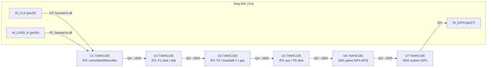
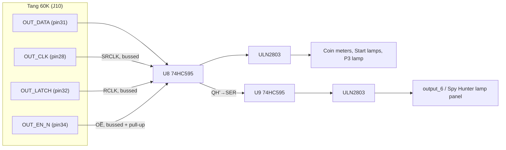
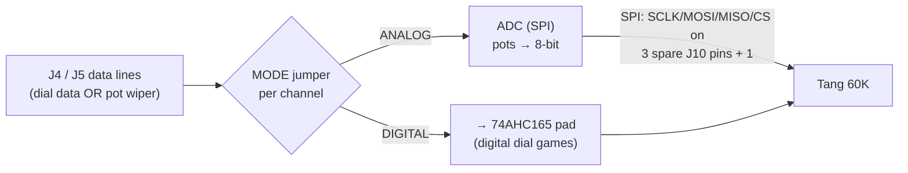
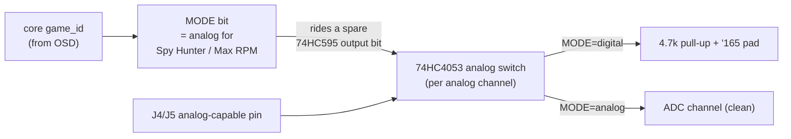

# MCR shield — connector footprints & chip wiring

Build companion to `shield_j10_pinout.md` (the FPGA-side header) and
`universal_mcr_shield_spec.md` (electrical spec). This is the **cabinet
side**: which physical connectors the harness plugs into, and how the
input/output/analog chips wire between those connectors and the J10 header.

Interface style is settled (spec §0): the **cabinet harness plugs into the
shield**; the FPGA maps every pin per game, so nothing is rewired. Rev A
targets the **SSIO-family connectors** (MCR-1/2 + SSIO MCR-3).

Connector types, pin counts and **pitch** are from **`docs/MCR Series
Pinouts.html`** (John Sanford's archived MCR reference) — the real board
connectors. Per-pin/per-game signal meaning is in that file and
`docs/mcr_game_input_matrix.md`. Still confirm the exact housing/keying
against a physical harness before ordering.

---

## 1. Cabinet connectors (what the harness plugs into)

Authoritative source: **`docs/MCR Series Pinouts.html`** (John Sanford's MCR
pinout reference, archived) — the real board-connector table. **These are
the actual MCR connectors and this is the real J-numbering** (it matches
MAME's `ssio:IP*` J-comments). It supersedes the normalized numbering in the
"Master Pinout Matrix" PDF (whose J2/J3/J4/J5 are *cabinet-function*
labels, not the physical connectors) — for footprints, use THIS table.

**Only the power connector is .156"; every signal connector is .100" MTA:**

| Ref | Board | Pins | Pitch | Carries |
|---|---|---:|---|---|
| **J1** | CPU | 20 | **.156" MTA** | **Power in**: +5 V ×4, GND ×4, +12 V, V.BATT, RESET, audio GND, key |
| **J2** | CPU | 9 | **.100" MTA** | **Video**: Red, G, B (+ Video GND ×3), key, HSync(−), VSync(−) |
| **J3** | — | 9/10 | **.100" MTA** | **Audio** out + a volume-control pot |
| **J4** | SSIO | 19 | **.100" MTA** | **IP0** (Coin1/2, 1P/2P Start, button, Tilt, Service, Test, GND) + **IP1** (D0–D7 game inputs, key) |
| **J5** | SSIO | 23 | **.100" MTA** | **IP2** (P2 controls / trackball-Y / more inputs) |
| **J6** | SSIO | 10 | **.100" MTA** | **IP4** (aux: P3 stick, second dial, etc.) |

**MTA = the AMP/TE MTA series** (MTA-156 for J1, **MTA-100 for J2–J6**).
Classic Bally/Midway friction-lock IDC headers. Match the exact pin count
and keyed position per connector; the per-pin/per-game signal detail is in
the HTML above and `docs/mcr_game_input_matrix.md`.

Consequences for the shield footprints:
- **The input chain feeds off J4 (19-pin), J5 (23-pin), J6 (10-pin)** — all
  **.100"**. J4 alone carries IP0 **and** IP1 (coins/starts/button + the
  8-bit player/dial bus), so it's the busiest connector.
- **J1 is the only .156" part** — and the shield ideally powers from its own
  12 V terminal rather than the cabinet 5 V rail (spec §6.1), so J1 may only
  be needed for V.BATT/RESET/audio-GND references, not the 5 V rail.
- **Video is J2 (.100", 9-pin)** — not a .156 part. The R2R DAC + sync buffer
  drive it.
- **Audio + volume is J3 (.100")** — the original had a panel volume pot on
  J3; keep a pot footprint or fix the level in the PWM/amp stage.
- **Key pins** (J1, J2-7, J4-14) are mechanical keys — leave blank/plugged.
- Grounds (J4-9, Video GNDs, J1 GNDs) tie to the shield star ground.

Note on the dial games: the 8-bit bus on J4/J6 (Tron, Kick, Kroozr, etc.) is
**parallel digital** — the cabinet's *Angle Encoder Board* converts the
knob's quadrature to parallel before the connector (MCR FAQ). So the '165
reads it directly **if that board is present**; a bare encoder would need
quadrature decode in the FPGA (`spinner.sv`).

Pin-by-pin, using the **real board numbering** (from `MCR Series
Pinouts.html`); the FPGA re-interprets the game-specific bits per game:

```
J1 (power): 1-4 +5V  5-8 GND  9 KEY  10 V.BATT  11 RESET  12 +12V  13 audio-GND
J2 (video): 1 Red  2 GND  3 Green  4 GND  5 Blue  6 GND  7 Key
            8 HSync(-)  9 VSync(-)
J3 (audio): speaker out + a 3-terminal volume pot
J4 (SSIO, IP0+IP1):
   IP0  1 Coin1  2 Coin2  3 1P-Start  4 2P-Start  5 Button/Fire
        6 Tilt   7 Service  8 Test    9 GND
   IP1  10-13 = D0..D3   14 Key   15-18 = D4..D7   (D0-7 = the game's
        player stick / dial / buttons, per docs/mcr_game_input_matrix.md)
J5 (SSIO, IP2):  23-pin — P2 controls / trackball-Y / more inputs
J6 (SSIO, IP4):  10-pin — aux (P3 stick, second dial, …)
```

---

## 2. Input chain — harness → 74AHC165 → FPGA

Every switch/data line goes: **cabinet pin → passive pad → 74AHC165
parallel input**. The FPGA clocks the chain out on 3 J10 pins
(`IN_CLK`/`IN_LOAD_N`/`IN_DATA`). Allocate **one '165 per SSIO input port**
(spec/pinout §6a) so 3-player and remapped-connector games all fit.

### 2a. The per-line conditioning pad (identical on every input)

```
   cabinet pin ──┬───[ 4.7kΩ ]─── +5V        (pull-up: idle = high)
                 │
                 └───[ 1kΩ ]──┬────────── 74AHC165 input (A..H)
                              │
                    10nF ═════╪═════ GND      (RC ~10µs debounce/filter)
                              │
                    BAT54S ───┤          (clamp to +5V / GND: a 12V
                     (dual)   │           miswire drops across the 1kΩ)
```

74AHC165 runs at **3.3 V**; its inputs are 5.5 V-tolerant, so they take the
5 V harness levels directly (spec §2). Idle = 5 V = logic 1; a closed
switch pulls to GND = logic 0 — the same polarity the SSIO saw.

### 2b. Chain topology (7 devices, 3 FPGA pins)



`IN_LOAD_N` low pulse snapshots **all** '165 inputs at the same instant, so
the 8-bit dial/trackball buses can't tear. Control lines (`CP`, `PL̄`) bus
to every device; only the last device's `QH` returns on `IN_DATA`.

Per-'165 pin map (all devices identical): `CP`=pin2, `PL̄`=pin1,
`QH`=pin9, `SER`(cascade in)=pin10, `CE̅`=pin15→GND, `VCC`=pin16→3V3,
`GND`=pin8. Parallel inputs A..H = pins 11,12,13,14,3,4,5,6.

### 2c. Which harness pins land on which '165

| '165 | SSIO byte | Real connector pins → A..H |
|---|---|---|
| U1 | IP0 | **J4 pins 1-8**: Coin1, Coin2, 1P-Start, 2P-Start, Button, Tilt, Service, Test |
| U2 | IP1 | **J4 pins 10-13,15-18**: D0..D7 (the game's P1 stick / dial / extra buttons) |
| U3 | IP2 | **J5** (23-pin): P2 controls / trackball-Y / more inputs |
| U4 | IP4 | **J6** (10-pin): aux — **P3 stick (Rampage)**, second dial, … |
| U6/U7 | IP3 | on-shield SW1 / SW2 DIP banks (no harness) |

Because it's the real connectors, the mapping is clean — one '165 per SSIO
byte, and J4 alone feeds U1+U2. What the D0–D7 bits on IP1 (and IP2/IP4)
*mean* is per game (stick vs dial vs buttons); the FPGA maps it, so the
wiring is identical across all games.

---

## 3. Output chain — FPGA → 74HC595 → ULN2803 → loads

Two '595s (16 bits) on 4 J10 pins (`OUT_CLK`/`OUT_DATA`/`OUT_LATCH`/
`OUT_EN_N`), then a ULN2803 per '595 for the 12 V coin meters/lamps.



- `OUT_EN_N` **must have a 10 kΩ pull-up to 3V3 on the shield** so all
  outputs stay off through FPGA configuration (no coin-meter clicks).
- ULN2803 has built-in flyback diodes — fine for inductive coin meters.
- Loads run off cabinet 12 V; the ULN sinks to GND.

Per-'595: `SER`=pin14, `SRCLK`=pin11, `RCLK`=pin12, `OE̅`=pin13,
`QH'`(cascade)=pin9, `QA..QH`=pins15,1..7, `VCC`=16→3V3, `GND`=8.

---

## 4. Analog controls — the ADC (Spy Hunter & Max RPM only)

**Which games need it:** exactly two, both later-phase:

| Game | Family | Pots | MAME device |
|---|---|---|---|
| **Spy Hunter** | MCR3Scroll | steering + gas (2, muxed) | on-board ADC0848/0844 |
| **Max RPM** | MCR3Mono | 2 wheels + 2 pedals (4) | ADC0844 |

**Every other MCR control is digital** — buttons/sticks are switches, and
the dials/spinners/trackballs (Tron, Kick, Kroozr, Wacko, Two Tigers, Discs
of Tron) are **optical encoders**, which the FPGA decodes with the existing
`spinner.sv` quadrature logic. No ADC for any of those.

Why an ADC is needed here and nowhere else: on the real hardware the
steering/gas **potentiometers' analog wiper voltage came into the game
board and was digitized by an on-board ADC0844** (MAME instantiates it in
the machine config, e.g. `ADC0844(config, m_maxrpm_adc)` with the pots on
its channels). Our shield replaces that board, so it must carry the ADC to
read the pots. The pot wires arrive on the **Opt X (J4) / Opt Y (J5)**
lines — the same physical pins a dial game would drive digitally.

### 4a. Put it on the board with a switch — yes, and here's how

Because a cabinet is *one* game, and the analog pins overlap the digital
Opt X/Opt Y pins, route those lines to **either** the '165 (digital) **or**
the ADC (analog), selected per cabinet:



Recommended parts and wiring:
- **ADC: a modern SPI ADC — ADS7830 (8-ch, I²C) or MCP3208 (8-ch, SPI),
  populate-optional.** (You *can* use a real ADC0844 to match, but a modern
  SPI/I²C part is far easier to talk to from the FPGA and needs no special
  timing.) 8 channels covers Max RPM's 4 and Spy Hunter's 2 with room.
- **Analog reference / conditioning:** each pot wiper → RC (series ~1 kΩ,
  100 nF to GND) → ADC channel; pot ends to the shield's clean 5 V and GND.
- **MODE jumpers:** a small 2-pin jumper (or a 2-pole DIP) per analog
  channel selects that harness line to the '165 pad or the ADC input. Set
  once at install ("this cabinet is Spy Hunter → Opt X = ANALOG").
- **FPGA side:** the ADC's SPI/I²C lands on **spare J10 pins** (9, 19, 20,
  29/30, 38 are free) — no impact on the input/output chains. The core reads
  the ADC channels and feeds the digitized value into the analog input port;
  the running game_id tells it whether to use the ADC or the '165 byte.

### 4b. FPGA-driven mode switch (recommended — no jumper)

The manual jumper works, but the FPGA can drive the digital/analog switch
itself, which keeps the "select the game, nothing else" promise for the
analog cabinets too. It's actually cleaner **and reuses hardware already on
the shield**:



How it works, step by step:

1. **The FPGA already knows the running game** (`game_id` from the OSD). It
   derives one **MODE** bit — high only for Spy Hunter / Max RPM. MODE is
   static per game (set when the game loads, never changes mid-play).
2. **MODE rides a spare bit of the existing 74HC595 output chain** — no new
   J10 pin. The '595s are already on the board for lamps/meters; one unused
   output bit becomes the mode line.
3. That bit drives a **74HC4053-class analog switch** on each analog-capable
   channel (≈4: Max RPM's worst case). In **digital** mode the pin routes to
   its normal pull-up + '165 pad; in **analog** mode the switch **lifts the
   pull-up** and routes the pin straight to the ADC channel. Lifting the
   pull-up is the whole point — a 4.7 kΩ pull-up to 5 V would offset a pot's
   reading, so it must be out of circuit for analog.
4. In analog mode the '165 still *sees* that pin and clocks in some
   arbitrary 0/1 — **harmless, the FPGA ignores those bits for that game.**

**Bonus you get for free:** the *channel* muxing (steering vs gas; which of
Max RPM's four axes) was **already game-driven on the original hardware** —
the game wrote the ADC0844's channel select and RD/WR strobes through its
SSIO output ports (`mcr3.cpp`: Max RPM latches the mux on `output`, Spy
Hunter toggles the ADC via an output bit). Our core reproduces those output
ports, so if you wire the core's `output_4/5/6` to the ADC's channel-select/
strobe lines, the game sequences the ADC exactly as it did in 1984 — no
extra logic. The only *new* thing is the per-cabinet digital-vs-analog pin
routing (MODE), because a universal shield serves both a dial cabinet and a
pot cabinet on the same pins, whereas the original Spy Hunter board was
always analog.

**Recommendation:** design for the FPGA-driven switch (MODE on a '595 bit +
74HC4053s), and keep a **manual override jumper in parallel** as a
populate-option fallback — cheap insurance while the analog path is
unproven. Cost over the jumper-only build: ~one 74HC4053 (maybe two) and a
few traces; payoff: the analog cabinets are as plug-and-play as the rest.

**One detail to lock down at Phase D:** exactly which harness pins carry the
Spy Hunter / Max RPM pot wipers (the master matrix normalizes them onto the
"Opt X D0–D7" label, but 2 pots ≠ 8 data bits, so the physical wiper pins
need confirming against those games' schematics). Finalize the analog
channel count and pin map when the first analog core (Spy Hunter) is brought
up — until then, route the ADC + switch footprints for the worst case (4
channels) and leave them unpopulated.

---

## 5. Video DAC & sync buffer (live today)

- **RGB:** 3-bit R2R per gun into **J2** (the 9-pin .100" video conn) pins
  1/3/5 — MSB 510 Ω, then 1 kΩ, 2 kΩ,
  summed into the monitor's 75 Ω ≈ 1 Vp-p (bench-proven, `bench_wiring.md`).
  Drive from J10 `VID_R/G/B` (§ pinout). J2 pins 2/4/6 = Video GND.
- **Sync:** J10 `VID_HS`/`VID_VS` (3.3 V, negative) → 74HCT244 at 5 V (TTL
  thresholds accept 3.3 V in) → J2 pins 8/9. Real MCR monitors take separate
  H/V; the pin-39/40 straps offer csync for OSSC/RetroTink gear.
- **15 kHz:** close the J10 pin-37 solder jumper for cabinet timing.

---

## 6. Power

Cabinet **+12 V → screw terminal → buck (5 V, ≥1.5 A) → LDO (3.3 V)**.
5 V feeds the AHC/HC logic rails and the input pull-ups; 3.3 V is the logic
VCC and the FPGA level. Audio amp (LM386) runs off the 12 V rail. Do not
back-feed the cabinet 5 V (spec §6.1).

---

## 7. BOM summary (control interface)

| Qty | Part | Role |
|---:|---|---|
| 7 | 74AHC165 | input chain (5 V-tolerant, 3.3 V VCC) |
| 2 | 74HC595 | output chain |
| 2 | ULN2803 | 12 V coin-meter / lamp drivers |
| 1 | 74HCT244 | 5 V sync buffer |
| 1 | ADS7830 / MCP3208 (opt.) | analog pots (Spy Hunter / Max RPM) |
| 1–2 | 74HC4053 (opt.) | FPGA-driven digital/analog mode switch (§4b); MODE rides a spare '595 bit |
| — | manual MODE jumper (opt., fallback) | override the FPGA switch per cabinet |
| — | R2R resistors (9), sync caps, BAT54S clamps, pull-ups | passives |
| 1 | buck + LDO | 12 V → 5 V → 3.3 V |
| — | MCR MTA connectors: J1 (.156" 20-pin power), J2–J6 (.100" MTA: video/audio/inputs) | harness interface |

Everything except the ADC block is required for every cabinet; the ADC
block is populate-if-analog.
