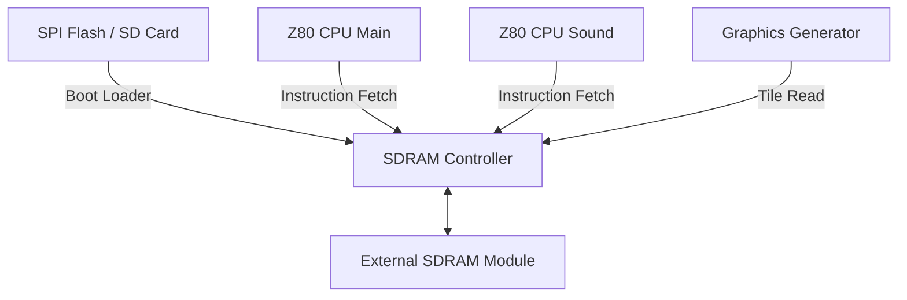

# MCR2 Port V2 Handoff & PCB Design Specification

This document details the architectural path to upgrade the core to **Version 2 (SDRAM support)** and outlines the electrical/physical requirements to design a custom **Universal Bally Midway MCR Cabinet Interface Shield (Option A)** that plugs into the Tang Primer 25K Dock.

---

## 1. SDRAM Integration & Core Changes (V2)

In Version 1, the playfield background tile ROMs were disabled to free up Block RAM (BSRAM) blocks for the active RAM caches and line buffers. In Version 2, we will add the external SDRAM controller to store all ROM assets, freeing up internal BSRAM and enabling playfield graphics and cabinet artwork overlays.



### Key Changes Required in RTL
1. **Porting the SDRAM Controller:**
   * Copy the SDRAM controller from the Nestang project ([sdram.sv](file:///Users/alans/Documents/development/TangPrimer-25K-example/nestang_primer-25K/src/rtl/sdram.sv)). The Primer 25K SDRAM module is a standard SDR-SDRAM (typically 64Mbit or 128Mbit with a 16-bit wide data bus).
2. **Boot ROM Loader:**
   * Implement a boot loader state machine in the top wrapper (`mcr2_primer25k_top.sv`). 
   * On reset, this loader reads the game ROM binaries from the SPI Flash (at a offset like `0x100000`) or from a MicroSD card via SPI, and streams them into the SDRAM.
   * Once loading is done, the Z80 reset line is released and the game runs.
3. **Memory Bus Arbitration:**
   * Since the main CPU, sound CPU, sprite generator, and background generator all need to read from SDRAM, you must implement a simple round-robin arbiter inside the controller. The controller runs at **100MHz+**, giving enough bandwidth to multiplex requests from all four subsystems.
4. **Restoring Graphics in `mcr2.vhd`:**
   * Re-enable the instantiations of `bg_graphics_1` and `bg_graphics_2` and change their generic memory type to point to SDRAM read requests instead of internal `dpram` instances.

---

## 2. Universal MCR Cabinet Interface Shield PCB Design

Rather than translating signals to a modern standard like JAMMA, the shield can expose the **original Bally Midway MCR header connectors (J2, J3, J4, J5, and Video)**. 

This creates a **direct drop-in replacement** for the original bulky Bally Midway CPU board. You can unplug the original board from the cabinet, and plug the Tang Primer 25K + Dock + Shield assembly directly into the cabinet's original wire harness.

### Why No DIP Switches Are Needed:
As documented in the `Ultimate MCR Master Pinout Matrix`, the physical connectors and pinout routing are standard across all MCR-1, MCR-2, and MCR-3 games. 
* A physical pin like **J2-1** is routed to standard player controls in all cabinets, but its function changes depending on the game (e.g. Up in *Tron*, Left in *Satan's Hollow*, Machine Gun in *Spy Hunter*).
* Because all J2/J3/J4/J5 pins are routed to static, dedicated FPGA GPIO inputs, **no physical DIP switches or rewiring is needed on the PCB**. The mapping of inputs to gameplay functions is handled **entirely in the SystemVerilog wrapper** of each specific game core!

```
                    +------------------------------------+
                    |        Tang Primer 25K Dock        |
                    +---[PMOD 1]------------[40-Pin]-----+
                              |                |
                       Parallel GPIOs     Parallel GPIOs
                              |                |
                    +------------------------------------+
                    |       Universal MCR Shield PCB     |
                    +--[J2]----[J3]----[J4]----[J5]--[V]-+
```

### A. Power Delivery
The original MCR cabinet harness provides **+12V** (for audio amps) and **+5V** (for logic).
* Place a **5V step-down buck converter** on the shield to feed clean +5V into the Dock's power inputs.
* Route the +12V rail directly to the onboard audio amplifier.

### B. Input Protection & Level Shifting
Arcade cabinet buttons are connected to long wire harnesses that act as antennas for ESD and electromagnetic noise.
* Use **opto-isolators** (e.g., TLP281-4) or logic buffers (e.g., 74LVC244) to isolate cabinet inputs from the FPGA.
* Use external 4.7kΩ pull-up resistors to 5V on the cabinet side of the buffers to keep inputs stable.

```
 Cabinet Switch (GND) ---> [ 4.7k Pull-up to 5V ] ---> [ Optocoupler / Buffer ] ---> FPGA Pin (3.3V)
```

### C. Analog Video DAC (RGB + Sync)
Midway MCR games output video at a 15kHz horizontal sync rate. The daughterboard must convert the 3-bit digital color lines (`cab_r/g/b`) to standard analog $1\text{V}_{\text{p-p}}$ video.
* **Resistor Ladder DAC (R2R):** Use standard 1% resistors to build an R2R ladder DAC for the red, green, and blue outputs.
* **Sync Buffers:** Convert the digital Sync outputs (`cab_hs` and `cab_vs` or `cab_csync`) from 3.3V to 5V TTL levels using a simple NPN transistor driver (like the BC847) before sending them to the original MCR Video connector.

```
 cab_r[2] (MSB) ---> [ 510 Ohm ] ---+
                                    |---> Analog Red (75 Ohm load on monitor)
 cab_r[1]       ---> [  1k Ohm  ] ---+
 cab_r[0] (LSB) ---> [  2k Ohm  ] ---+
```

### D. Audio Circuit
* Route the `audio_l` and `audio_r` pins through a dual-stage RC low-pass filter (cutoff frequency around 15kHz) to smooth the digital PWM into analog audio.
* Feed the analog audio into an audio amplifier chip (e.g., **LM386** or **TDA2003**) powered by the +12V rail, and connect the output to the mono speaker terminals.

---

## 3. Recommended Pinout Mapping (Dock to MCR Connectors)

Below is the pin mapping showing how the FPGA's expansion ports should route to the standard MCR J2, J3, J4, and J5 headers.

### J2 Connector (Player 1 Controls)
| Pin | Standard MCR Function | Dock Pin |
| :--- | :--- | :--- |
| **J2-1** | P1 Up / P1 Left / Weapon 1 | PMOD 1.4 (L5) |
| **J2-2** | P1 Down / P1 Right / Weapon 2 | PMOD 1.10 (K5) |
| **J2-3** | P1 Left / Utility Button | PMOD 1.3 (K11) |
| **J2-4** | P1 Right / Utility Button | PMOD 1.9 (L11) |
| **J2-5** | P1 Button 1 (Fire / Serve / Kick) | PMOD 1.2 (E11) |
| **J2-6** | P1 Button 2 (Shield / Catch / Deflect) | PMOD 1.1 (A11) |
| **J2-13**| Ground | PMOD 1.5 (GND) |

### J3 Connector (System & Coins)
| Pin | Standard MCR Function | Dock Pin |
| :--- | :--- | :--- |
| **J3-1** | Coin 1 | PMOD 1.9 (L11) *shared/dual-mapped* |
| **J3-2** | Coin 2 | PMOD 1.8 (E10) |
| **J3-3** | Start 1 | PMOD 1.10 (K5) *shared/dual-mapped* |
| **J3-4** | Start 2 | PMOD 1.7 (A10) |
| **J3-5** | Tilt Switch | PMOD 1.7 (A10) *shared/dual-mapped* |

### J4 Connector (Opt X / Spinner / Steering Dial)
These pins handle the 8-bit parallel dial/spinner outputs (like Tron's spinner wheel or Spy Hunter's steering):
| Pin | Standard MCR Function | Dock Pin |
| :--- | :--- | :--- |
| **J4-1** | Data Bit 0 (Opt X) | 40-Pin 5 (H4) |
| **J4-2** | Data Bit 1 (Opt X) | 40-Pin 6 (G4) |
| **J4-3** | Data Bit 2 (Opt X) | 40-Pin 7 (J2) |
| **J4-4** | Data Bit 3 (Opt X) | 40-Pin 8 (J8) |
| **J4-5** | Data Bit 4 (Opt X) | 40-Pin 9 (J1) |
| **J4-6** | Data Bit 5 (Opt X) | 40-Pin 10 (D1) |
| **J4-7** | Data Bit 6 (Opt X) | 40-Pin 11 (L9) |
| **J4-9** | Data Bit 7 (Opt X) | 40-Pin 12 (K8) |
| **J4-10**| Ground | 40-Pin 2 (GND) |

### J5 Connector (Opt Y / Trackball / Player 2 Controls)
| Pin | Standard MCR Function | Dock Pin |
| :--- | :--- | :--- |
| **J5-1** to **J5-6** | Player 2 Mux / Trackball Y (D0 - D5) | 40-Pin 13 to 18 |
| **J5-15** | P2 Up / Trackball Y D6 | 40-Pin 19 |
| **J5-16** | P2 Down / Trackball Y D7 | 40-Pin 20 |
| **J5-17** | P2 Left | 40-Pin 21 |
| **J5-18** | P2 Right | 40-Pin 22 |
| **J5-19** | P2 Button 1 | 40-Pin 23 |

### Video Connector (MCR Standard)
| Pin | MCR Video Function | Dock / DAC Signal |
| :--- | :--- | :--- |
| **Video-1** | Red | Analog Red (from DAC on K2, K1, L1) |
| **Video-2** | Video GND | Video Ground |
| **Video-3** | Green | Analog Green (from DAC on L2, K4, J4) |
| **Video-4** | Video GND | Video Ground |
| **Video-5** | Blue | Analog Blue (from DAC on G1, G2, E1) |
| **Video-6** | Video GND | Video Ground |
| **Video-8** | H-Sync (-) | Sync Buffer (from F1 / A1) |
| **Video-9** | V-Sync (-) | Sync Buffer (from F2) |

---

## 4. Pinout Mapping for Tang Console 60K & 138K (2x20 Header Shield)

Because the **Tang Console 60K & 138K** cores fit entirely inside the FPGA's internal BRAM, you have **92 free GPIO pins** on the board's two 2x20-pin expansion headers. This allows for a completely parallel shield design with zero multiplexing or serial converters.

Below is the pin mapping between the original Bally Midway MCR harness and the 2x20 GPIO Header pins as defined in `mcr2_console60k.cst` and `mcr2_console138k.cst`:

### Cabinet Controls (J2 & J3)
| MCR Pin | Signal | 2x20 Header Pin Name | FPGA Pin |
| :--- | :--- | :--- | :--- |
| **J2-1** | P1 Up / Left | `btn_left` | A10 |
| **J2-2** | P1 Down / Right | `btn_right` | A11 |
| **J2-3** | P1 Left / Utility | `btn_fire` | B10 |
| **J2-4** | P1 Right / Utility | `btn_shield` | B11 |
| **J2-5** | P1 Button 1 (Fire) | `btn_start` | C10 |
| **J2-6** | P1 Button 2 (Shield) | `btn_coin` | C11 |
| **J3-1** | Coin 1 | `btn_service` | D10 |
| **J3-3** | Start 1 | `btn_tilt` | D11 |

### Cabinet Video (RGBS) & Audio Outputs
| MCR Pin | Signal | 2x20 Header Pin Name | FPGA Pin |
| :--- | :--- | :--- | :--- |
| **Video-1** | Analog Red | `cab_r[0]` (LSB) | F10 |
| | | `cab_r[1]` | F11 |
| | | `cab_r[2]` (MSB) | G10 |
| **Video-3** | Analog Green | `cab_g[0]` (LSB) | H10 |
| | | `cab_g[1]` | H11 |
| | | `cab_g[2]` (MSB) | J10 |
| **Video-5** | Analog Blue | `cab_b[0]` (LSB) | K10 |
| | | `cab_b[1]` | K11 |
| | | `cab_b[2]` (MSB) | L10 |
| **Video-8** | H-Sync (-) | `cab_hs` | M10 |
| **Video-9** | V-Sync (-) | `cab_vs` | M11 |
| | CSync (-) | `cab_csync` | N10 |
| | Audio Left PWM | `audio_l` | P10 |
| | Audio Right PWM | `audio_r` | P11 |

*Note: You can easily update these constraints in your target project's `.cst` file to match whatever layout you choose for your custom KiCad or Altium PCB Shield.*

---

## 5. DIP-Switch ROM Selection & Game Lists (Multi-Game Cabinet)

Instead of compiling an on-screen game loader, we can place a hardware **DIP Switch Block** on our custom Shield PCB to select which game boots from the MicroSD card. At power-on, the bootloader reads the states of these switches and writes the corresponding ROM assets into BRAM/DRAM, creating an authentic, menu-free arcade experience.

### A. Bally Midway MCR Game Lists

The Bally Midway MCR family is split into five hardware categories:

1. **MCR-1 (3 Games):**
   * *Kick / Kick-Man*
   * *Solar Fox*
2. **MCR-2 (6 Games):**
   * *Satan's Hollow*
   * *Tron*
   * *Kozmik Krooz'r*
   * *Wacko*
   * *Domino Man*
   * *Two Tigers*
3. **MCR-3 (4 Games):**
   * *Tapper*
   * *Discs of Tron*
   * *Journey*
   * *Timber*
4. **MCR-Scroll (3 Games):**
   * *Spy Hunter*
   * *Crater Raider*
   * *Turbo Tag*
5. **MCR-Monoboard (6 Games):**
   * *Demolition Derby*
   * *Rampage*
   * *Sarge*
   * *Power Drive*
   * *Max RPM*
   * *Star Guards*

*   **Total Unified Library:** **22 Games**

---

### B. Bit Requirements for DIP Switch Selection

To select a game from these lists, we need the following number of binary inputs:

*   **MCR-2 Only Multi-Game:** **3 Bits** ($2^3 = 8$ configurations, covers all 6 MCR-2 titles).
*   **MCR-3 Only Multi-Game:** **2 Bits** ($2^2 = 4$ configurations, covers all 4 MCR-3 titles).
*   **Fully Unified MCR Cabinet:** **5 Bits** ($2^5 = 32$ configurations, covers all 22 MCR games in the library).

### C. Recommended Hardware Design

We recommend placing an **8-position DIP Switch Block** on the custom Shield PCB. 
*   **Switch 1–5:** Game Selector (5 bits, representing binary values `0` to `31` for the 22 games).
*   **Switch 6–8:** System Config (e.g. Free Play force, Test Mode force, Cabinet CRT aspect/doubler bypass).

```text
               +5V / +3.3V
                 |
               [ 10k Pull-up Array ]
                 |
  FPGA GPIOs ----+-------+-------+-------+
                 |       |       |       |
               [SW1]   [SW2]   [SW3]   [SW4]  (DIP Switch Block)
                 |       |       |       |
                GND     GND     GND     GND
```
*   **Pins needed:** Since the **Tang Console 60K/138K** has 92 free GPIOs, allocating **8 dedicated pins** directly to these switches is trivial and leaves the board with massive IO capacity.


